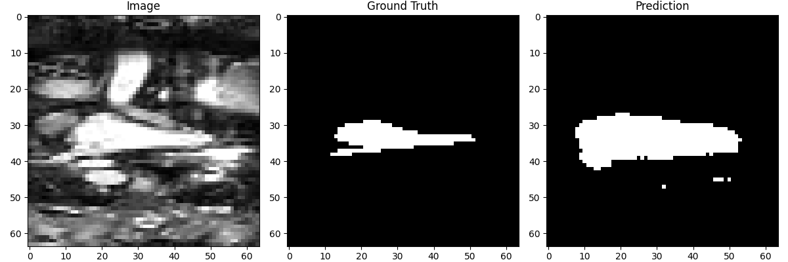
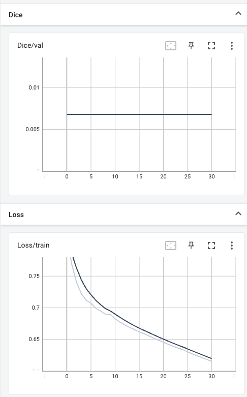

## Objective 

This report summarizes the evaluation results of a 3D U-Net model trained to automatically segment the left atrium from heart MRI scans. The model was trained on preprocessed volumetric data from the Medical Decathlon Task02_Heart dataset.

## Evalution Metrics

The evaluation metrics were computed on a held-out validation set using standard segmentation performance indicators. The following scores were obtained:

Dice Score: 0.0077

Jaccard Index (IoU): 0.0039

Precision: 0.0039

Recall: 1.0000

## Metric Interpretations

Dice Score and Jaccard Index (IoU) measure the overlap between predicted and ground truth segmentation masks. A perfect overlap yields a Dice score of 1 and a Jaccard score of 1.

Precision indicates the percentage of predicted positives that are actually true positives.

Recall quantifies the percentage of actual positives that the model correctly identified.

## Observations

The very low Dice and IoU scores suggest that the model's segmentation masks are poorly aligned with the ground truth.

The recall of 1.0000 implies that the model marks nearly every region as foreground, resulting in very high sensitivity but poor specificity.

Precision is extremely low, indicating that most of the predicted positive voxels do not correspond to actual left atrium regions.

I am not exactly sure why these metric are so low because in the training and validation visual results the segmenatation [see below] does not appear to be as horrible as the metrics make it out to be.


## Potential Causes

The model may be overfitting to the background class due to extreme class imbalance in the dataset.

The threshold for binarizing the predicted probability maps (0.3) may still be too high given the poor calibration of outputs.

The model could be undertrained or its architecture may lack the necessary capacity or regularization.

3D spatial context may not be adequately captured at the current resolution which is 32x64x64. I had to do this because the training was taking an extremely long time and the only viable solution that I found was reducing the image resolution. 

## Model Architecture

```python
class DoubleConv(nn.Module):
    def __init__(self, in_channels, out_channels):
        super(DoubleConv, self).__init__()
        self.double_conv = nn.Sequential(
            nn.Conv3d(in_channels, out_channels, kernel_size=3, padding=1),
            nn.BatchNorm3d(out_channels),
            nn.ReLU(inplace=True),
            nn.Conv3d(out_channels, out_channels, kernel_size=3, padding=1),
            nn.BatchNorm3d(out_channels),
            nn.ReLU(inplace=True)
        )

    def forward(self, x):
        return self.double_conv(x)

class UNet3D(nn.Module):
    def __init__(self, in_channels=1, out_channels=1):
        super(UNet3D, self).__init__()

        self.enc1 = DoubleConv(in_channels, 32)
        self.pool1 = nn.MaxPool3d(2)
        self.enc2 = DoubleConv(32, 64)
        self.pool2 = nn.MaxPool3d(2)
        self.enc3 = DoubleConv(64, 128)
        self.pool3 = nn.MaxPool3d(2)

        self.bottleneck = DoubleConv(128, 256)

        self.up3 = nn.ConvTranspose3d(256, 128, kernel_size=2, stride=2)
        self.dec3 = DoubleConv(256, 128)
        self.up2 = nn.ConvTranspose3d(128, 64, kernel_size=2, stride=2)
        self.dec2 = DoubleConv(128, 64)
        self.up1 = nn.ConvTranspose3d(64, 32, kernel_size=2, stride=2)
        self.dec1 = DoubleConv(64, 32)

        self.out_conv = nn.Conv3d(32, out_channels, kernel_size=1)
```

This model is a 3D version of U-Net, which is a type of neural network that’s really good for stuff like segmenting images, basically finding where objects are. Instead of working with 2D images, this one works with 3D volumes (like MRI or CT scans).

At the beginning, the model starts with a DoubleConv block, which just means it does two 3D convolutions back to back, each followed by batch normalization and ReLU to help it learn better and faster. This part is like the model’s way of learning basic patterns in the image.

Then we have some pooling layers that shrink the size of the volume (kind of like zooming out), so the model can look at bigger patterns. After each pooling, there’s another DoubleConv, and this happens a few times. By the time we reach the bottleneck, the model is seeing a really zoomed-out view and learning deep features.

Next, we go back up using transpose convolutions (basically upsampling or zooming back in), and we combine those with earlier layers (that’s the skip connection part). This helps the model remember both the big picture and the details. After that, it goes through more DoubleConv layers to refine the features.

Finally, there’s one last convolution at the end that squishes everything down to a single output channel (like a prediction map), and that’s the segmentation result.

## Loss and Dice Value graphs


Looking at the TensorBoard plots, the training loss is going down pretty smoothly, which means the model is learning something from the training data. But the validation Dice score is barely changing and stays really low the whole time. That’s not a good sign because it means the model isn’t doing well on new, unseen data. It might be memorizing the training set instead of actually learning how to segment correctly. This could be happening because the model can’t find the important parts in the images, or maybe the labels are hard to learn from. It could also be that there’s way more background than actual heart tissue, so the model just predicts everything as background.